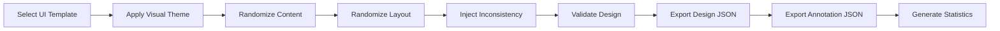

<div align="center">

# 🎨 Synthetic Figma UI Dataset Generator

**A synthetic dataset generation framework for creating Figma-style UI design JSON files with automatically injected UI/UX inconsistencies — built for training AI models to detect usability issues.**

Grounded in **Jakob Nielsen's 10 Usability Heuristics** 🧠

[](https://opensource.org/licenses/MIT)
[](https://nodejs.org/)
[]()

</div>

---

## 📖 Overview

This project generates **thousands of synthetic Figma-like design files**, paired with structured annotations describing intentionally injected UI/UX inconsistencies — no manual labeling required.

Instead of hand-annotating thousands of Figma files, this framework **automatically generates realistic interface layouts** and injects **controlled, labeled usability violations** at scale.

**Use cases:**

| 🎯 Use Case | 💡 Description |
|---|---|
| AI Model Training | Supervised datasets for usability-issue detection |
| ML Research | Large-scale, labeled UI/UX benchmarks |
| Heuristic Detection | Automated Nielsen heuristic evaluation |
| Figma Plugin Dev | Test data for design-linting plugins |
| CV & Design Analysis | Visual + structural interface analysis |
| Academic Research | Reproducible usability research datasets |

---

## ✨ Features

- 🖼️ Multiple UI templates
- 🎨 Automatic theme randomization
- 📝 Automatic content randomization
- 📐 Automatic layout randomization
- ⚠️ Synthetic usability issue injection
- ✅ Automatic dataset validation
- 🏷️ Annotation generation
- 📊 Dataset statistics generation

---

## 🖥️ Supported UI Templates

- Login Screen
- Registration Screen
- Contact Form
- Dashboard
- Settings Screen
- Delete Confirmation Dialog
- Reset Confirmation Dialog

Each design is generated with **randomized content, colors, spacing, and layout** — while preserving realistic UI structure.

---

## 🗂️ Generated Dataset Categories

Four independent datasets are produced, each isolating a specific class of usability behavior.

### 1️⃣ Normal Dataset
The **negative class** — clean interfaces with no injected issues.
- Proper spacing
- Correct color usage
- Consistent button styles
- Appropriate confirmation dialogs
- Correct exit controls

### 2️⃣ Color Dataset
Injected color-related inconsistencies:
- Color Inconsistency
- Same Color for Different Actions
- Weak Error Visibility

### 3️⃣ Error Handling Dataset
Usability problems around error prevention & recovery:
- Missing Confirmation Dialog
- Missing Undo Functionality
- Missing Exit Control

### 4️⃣ Layout Dataset
Layout-related inconsistencies:
- Alignment Inconsistency
- Spacing Inconsistency
- Button Shape Inconsistency
- Overloaded Screen Density

---

## 🏗️ Project Structure

```text
src
├── builders
├── components
├── exporter
├── generators
├── injectors
├── mutators
│   ├── color
│   ├── errorHandling
│   └── layout
├── randomizers
├── templates
├── utils
├── validators
└── config.js

output
├── designs
│   ├── normal
│   ├── color
│   ├── error
│   └── layout
│
├── annotations
│   ├── normal
│   ├── color
│   ├── error
│   └── layout
│
└── statistics
```

---

## 📦 Generated Output

Each **design file** (Figma-like JSON) includes:

- Nodes, Frames & Components
- Text, Icons, Buttons, Input Fields
- Layout properties
- Colors
- Component hierarchy
- Metadata

Each **annotation file** includes:

- Design ID
- Dataset category
- Injected inconsistency
- Expected label
- Severity
- Affected nodes
- Validation status
- Confidence score

---

## ⚙️ Dataset Pipeline



---

## 🛠️ Technologies Used

- Node.js
- JavaScript
- JSON
- Figma-inspired Design Model

---

## 🚀 Installation

Clone the repository:

```bash
git clone https://github.com/YOUR_USERNAME/synthetic-figma-ui-dataset-generator.git
```

Install dependencies:

```bash
npm install
```

---

## ⚙️ Configuration

Dataset generation settings live in:

```text
src/config.js
```

Configurable options include:

- Dataset size
- Output directories
- Mutation probabilities
- Export options
- Randomization settings

---

## ▶️ Generate Dataset

Run the full generation pipeline:

```bash
node src/generators/generateAllDatasets.js
```

This automatically creates:

- ✅ Normal dataset
- 🎨 Color dataset
- ⚠️ Error Handling dataset
- 📐 Layout dataset
- 🏷️ Annotation files
- 📊 Dataset statistics

---

## 📁 Example Output

```text
output
├── designs
│   ├── normal
│   ├── color
│   ├── error
│   └── layout
│
├── annotations
│   ├── normal
│   ├── color
│   ├── error
│   └── layout
│
└── statistics
```

---

## 🎯 Research Objective

This project supports research on **automated UI/UX usability evaluation using Artificial Intelligence** — generating labeled datasets for training machine learning models to detect interface inconsistencies based on Jakob Nielsen's usability heuristics.

---

## 🔮 Future Improvements

- [ ] Additional UI templates
- [ ] Mobile and desktop layouts
- [ ] Accessibility issue generation
- [ ] Typography inconsistencies
- [ ] Navigation inconsistencies
- [ ] Responsive layout generation
- [ ] Dark mode variations
- [ ] Direct Figma plugin integration

---

<div align="center">

⭐ **If you find this project useful, consider giving it a star!** ⭐

</div>
